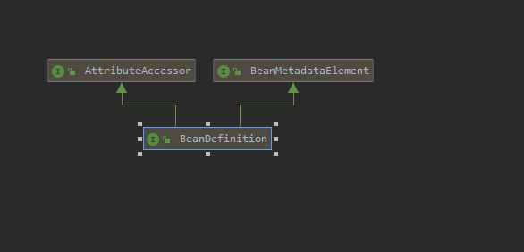
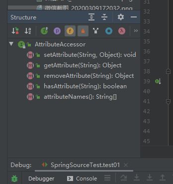

#### 什么是BeanDefinition

在Java中，一切皆对象。在JDK中使用java.lang.Class来描述类这个对象。

在Spring中，存在bean这样一个概念，那Spring又是怎么抽象bean这个概念，用什么类来描述bean这个对象呢？Spring使用BeanDefinition来描述bean。


#### BeanDefinition的类图



BeanDefinition继承了AttributeAccessor和BeanMetadataElement接口。

#### AttributeAccessor

这是一个属性访问者，它提供了访问属性的能力。



### BeanMetadataElement

BeanMetadataElement中只有一个方法，用来获取元数据元素的配置源对象：

```
public interface BeanMetadataElement {

	/**
	 * Return the configuration source {@code Object} for this metadata element
	 * (may be {@code null}).
	 */
	@Nullable
	Object getSource();

}
```


#### BeanDefinition

BeanDefinition接口是Spring对bean的抽象。

```
/*
 * Copyright 2002-2018 the original author or authors.
 *
 * Licensed under the Apache License, Version 2.0 (the "License");
 * you may not use this file except in compliance with the License.
 * You may obtain a copy of the License at
 *
 *      http://www.apache.org/licenses/LICENSE-2.0
 *
 * Unless required by applicable law or agreed to in writing, software
 * distributed under the License is distributed on an "AS IS" BASIS,
 * WITHOUT WARRANTIES OR CONDITIONS OF ANY KIND, either express or implied.
 * See the License for the specific language governing permissions and
 * limitations under the License.
 */

package org.springframework.beans.factory.config;

import org.springframework.beans.BeanMetadataElement;
import org.springframework.beans.MutablePropertyValues;
import org.springframework.core.AttributeAccessor;
import org.springframework.lang.Nullable;

/**
 * A BeanDefinition describes a bean instance, which has property values,
 * constructor argument values, and further information supplied by
 * concrete implementations.
 *
 * <p>This is just a minimal interface: The main intention is to allow a
 * {@link BeanFactoryPostProcessor} such as {@link PropertyPlaceholderConfigurer}
 * to introspect and modify property values and other bean metadata.
 *
 * @author Juergen Hoeller
 * @author Rob Harrop
 * @since 19.03.2004
 * @see ConfigurableListableBeanFactory#getBeanDefinition
 * @see org.springframework.beans.factory.support.RootBeanDefinition
 * @see org.springframework.beans.factory.support.ChildBeanDefinition
 */
public interface BeanDefinition extends AttributeAccessor, BeanMetadataElement {

	/**
	 * Scope identifier for the standard singleton scope: "singleton".
	 * <p>Note that extended bean factories might support further scopes.
	 * @see #setScope
	 */
	String SCOPE_SINGLETON = ConfigurableBeanFactory.SCOPE_SINGLETON;

	/**
	 * Scope identifier for the standard prototype scope: "prototype".
	 * <p>Note that extended bean factories might support further scopes.
	 * @see #setScope
	 */
	String SCOPE_PROTOTYPE = ConfigurableBeanFactory.SCOPE_PROTOTYPE;


	/**
	 * Role hint indicating that a {@code BeanDefinition} is a major part
	 * of the application. Typically corresponds to a user-defined bean.
	 */
	int ROLE_APPLICATION = 0;

	/**
	 * Role hint indicating that a {@code BeanDefinition} is a supporting
	 * part of some larger configuration, typically an outer
	 * {@link org.springframework.beans.factory.parsing.ComponentDefinition}.
	 * {@code SUPPORT} beans are considered important enough to be aware
	 * of when looking more closely at a particular
	 * {@link org.springframework.beans.factory.parsing.ComponentDefinition},
	 * but not when looking at the overall configuration of an application.
	 */
	int ROLE_SUPPORT = 1;

	/**
	 * Role hint indicating that a {@code BeanDefinition} is providing an
	 * entirely background role and has no relevance to the end-user. This hint is
	 * used when registering beans that are completely part of the internal workings
	 * of a {@link org.springframework.beans.factory.parsing.ComponentDefinition}.
	 */
	int ROLE_INFRASTRUCTURE = 2;


	// Modifiable attributes

	/**
	 * Set the name of the parent definition of this bean definition, if any.
	 */
	void setParentName(@Nullable String parentName);

	/**
	 * Return the name of the parent definition of this bean definition, if any.
	 */
	@Nullable
	String getParentName();

	/**
	 * Specify the bean class name of this bean definition.
	 * <p>The class name can be modified during bean factory post-processing,
	 * typically replacing the original class name with a parsed variant of it.
	 * @see #setParentName
	 * @see #setFactoryBeanName
	 * @see #setFactoryMethodName
	 */
	void setBeanClassName(@Nullable String beanClassName);

	/**
	 * Return the current bean class name of this bean definition.
	 * <p>Note that this does not have to be the actual class name used at runtime, in
	 * case of a child definition overriding/inheriting the class name from its parent.
	 * Also, this may just be the class that a factory method is called on, or it may
	 * even be empty in case of a factory bean reference that a method is called on.
	 * Hence, do <i>not</i> consider this to be the definitive bean type at runtime but
	 * rather only use it for parsing purposes at the individual bean definition level.
	 * @see #getParentName()
	 * @see #getFactoryBeanName()
	 * @see #getFactoryMethodName()
	 */
	@Nullable
	String getBeanClassName();

	/**
	 * Override the target scope of this bean, specifying a new scope name.
	 * @see #SCOPE_SINGLETON
	 * @see #SCOPE_PROTOTYPE
	 */
	void setScope(@Nullable String scope);

	/**
	 * Return the name of the current target scope for this bean,
	 * or {@code null} if not known yet.
	 */
	@Nullable
	String getScope();

	/**
	 * Set whether this bean should be lazily initialized.
	 * <p>If {@code false}, the bean will get instantiated on startup by bean
	 * factories that perform eager initialization of singletons.
	 */
	void setLazyInit(boolean lazyInit);

	/**
	 * Return whether this bean should be lazily initialized, i.e. not
	 * eagerly instantiated on startup. Only applicable to a singleton bean.
	 */
	boolean isLazyInit();

	/**
	 * Set the names of the beans that this bean depends on being initialized.
	 * The bean factory will guarantee that these beans get initialized first.
	 */
	void setDependsOn(@Nullable String... dependsOn);

	/**
	 * Return the bean names that this bean depends on.
	 */
	@Nullable
	String[] getDependsOn();

	/**
	 * Set whether this bean is a candidate for getting autowired into some other bean.
	 * <p>Note that this flag is designed to only affect type-based autowiring.
	 * It does not affect explicit references by name, which will get resolved even
	 * if the specified bean is not marked as an autowire candidate. As a consequence,
	 * autowiring by name will nevertheless inject a bean if the name matches.
	 */
	void setAutowireCandidate(boolean autowireCandidate);

	/**
	 * Return whether this bean is a candidate for getting autowired into some other bean.
	 */
	boolean isAutowireCandidate();

	/**
	 * Set whether this bean is a primary autowire candidate.
	 * <p>If this value is {@code true} for exactly one bean among multiple
	 * matching candidates, it will serve as a tie-breaker.
	 */
	void setPrimary(boolean primary);

	/**
	 * Return whether this bean is a primary autowire candidate.
	 */
	boolean isPrimary();

	/**
	 * Specify the factory bean to use, if any.
	 * This the name of the bean to call the specified factory method on.
	 * @see #setFactoryMethodName
	 */
	void setFactoryBeanName(@Nullable String factoryBeanName);

	/**
	 * Return the factory bean name, if any.
	 */
	@Nullable
	String getFactoryBeanName();

	/**
	 * Specify a factory method, if any. This method will be invoked with
	 * constructor arguments, or with no arguments if none are specified.
	 * The method will be invoked on the specified factory bean, if any,
	 * or otherwise as a static method on the local bean class.
	 * @see #setFactoryBeanName
	 * @see #setBeanClassName
	 */
	void setFactoryMethodName(@Nullable String factoryMethodName);

	/**
	 * Return a factory method, if any.
	 */
	@Nullable
	String getFactoryMethodName();

	/**
	 * Return the constructor argument values for this bean.
	 * <p>The returned instance can be modified during bean factory post-processing.
	 * @return the ConstructorArgumentValues object (never {@code null})
	 */
	ConstructorArgumentValues getConstructorArgumentValues();

	/**
	 * Return if there are constructor argument values defined for this bean.
	 * @since 5.0.2
	 */
	default boolean hasConstructorArgumentValues() {
		return !getConstructorArgumentValues().isEmpty();
	}

	/**
	 * Return the property values to be applied to a new instance of the bean.
	 * <p>The returned instance can be modified during bean factory post-processing.
	 * @return the MutablePropertyValues object (never {@code null})
	 */
	MutablePropertyValues getPropertyValues();

	/**
	 * Return if there are property values values defined for this bean.
	 * @since 5.0.2
	 */
	default boolean hasPropertyValues() {
		return !getPropertyValues().isEmpty();
	}

	/**
	 * Set the name of the initializer method.
	 * @since 5.1
	 */
	void setInitMethodName(@Nullable String initMethodName);

	/**
	 * Return the name of the initializer method.
	 * @since 5.1
	 */
	@Nullable
	String getInitMethodName();

	/**
	 * Set the name of the destroy method.
	 * @since 5.1
	 */
	void setDestroyMethodName(@Nullable String destroyMethodName);

	/**
	 * Return the name of the destroy method.
	 * @since 5.1
	 */
	@Nullable
	String getDestroyMethodName();

	/**
	 * Set the role hint for this {@code BeanDefinition}. The role hint
	 * provides the frameworks as well as tools with an indication of
	 * the role and importance of a particular {@code BeanDefinition}.
	 * @since 5.1
	 * @see #ROLE_APPLICATION
	 * @see #ROLE_SUPPORT
	 * @see #ROLE_INFRASTRUCTURE
	 */
	void setRole(int role);

	/**
	 * Get the role hint for this {@code BeanDefinition}. The role hint
	 * provides the frameworks as well as tools with an indication of
	 * the role and importance of a particular {@code BeanDefinition}.
	 * @see #ROLE_APPLICATION
	 * @see #ROLE_SUPPORT
	 * @see #ROLE_INFRASTRUCTURE
	 */
	int getRole();

	/**
	 * Set a human-readable description of this bean definition.
	 * @since 5.1
	 */
	void setDescription(@Nullable String description);

	/**
	 * Return a human-readable description of this bean definition.
	 */
	@Nullable
	String getDescription();


	// Read-only attributes

	/**
	 * Return whether this a <b>Singleton</b>, with a single, shared instance
	 * returned on all calls.
	 * @see #SCOPE_SINGLETON
	 */
	boolean isSingleton();

	/**
	 * Return whether this a <b>Prototype</b>, with an independent instance
	 * returned for each call.
	 * @since 3.0
	 * @see #SCOPE_PROTOTYPE
	 */
	boolean isPrototype();

	/**
	 * Return whether this bean is "abstract", that is, not meant to be instantiated.
	 */
	boolean isAbstract();

	/**
	 * Return a description of the resource that this bean definition
	 * came from (for the purpose of showing context in case of errors).
	 */
	@Nullable
	String getResourceDescription();

	/**
	 * Return the originating BeanDefinition, or {@code null} if none.
	 * Allows for retrieving the decorated bean definition, if any.
	 * <p>Note that this method returns the immediate originator. Iterate through the
	 * originator chain to find the original BeanDefinition as defined by the user.
	 */
	@Nullable
	BeanDefinition getOriginatingBeanDefinition();

}

```


#### AnnotatedBeanDefinition
AnnotatedBeanDefinition 继承了BeanDefinition，拓展了BeanDefinition接口的能力：
    
```
public interface AnnotatedBeanDefinition extends BeanDefinition {

	/**
	 * Obtain the annotation metadata (as well as basic class metadata)
	 * for this bean definition's bean class.
	 * @return the annotation metadata object (never {@code null})
	 */
	AnnotationMetadata getMetadata();

	/**
	 * Obtain metadata for this bean definition's factory method, if any.
	 * @return the factory method metadata, or {@code null} if none
	 * @since 4.1.1
	 */
	@Nullable
	MethodMetadata getFactoryMethodMetadata();

}

```


##### BeanDefinition常见实现类
- ChildBeanDefinition
- RootBeanDefinition
- GenericBeanDefinition
- AnnotatedGenericBeanDefinition
- ScannedGenericBeanDefinition


#### BeanDefinitionBuilder

BeanDefinitionBuilder是Builder模式的应用。通过这个类我们可以方便的构建BeanDefinition的实例对象。举个例子：

```
@Component
public class MyBeanDefinitionRegistryPostProcessor implements BeanDefinitionRegistryPostProcessor {
    @Override
    public void postProcessBeanDefinitionRegistry(BeanDefinitionRegistry registry) throws BeansException {

        System.out.println("postProcessBeanDefinitionRegistry...bean的数量："+registry.getBeanDefinitionCount());

        BeanDefinition beanDefinition = BeanDefinitionBuilder.genericBeanDefinition(StudentService.class)
                .addPropertyReference("dao", "userDao")
                .setInitMethodName("init")
                .setScope(BeanDefinition.SCOPE_SINGLETON)
                .getBeanDefinition();
        registry.registerBeanDefinition("studentService", beanDefinition);
    }

    @Override
    public void postProcessBeanFactory(ConfigurableListableBeanFactory beanFactory) throws BeansException {
        System.out.println("MyBeanDefinitionRegistryPostProcessor...bean的数量：" + beanFactory.getBeanDefinitionCount());
    }
}
```
BeanDefinitionRegistryPostProcessor继承了BeanFactoryPostProcessor接口，同时又增加了一个新的方法BeanDefinitionRegistryPostProcessor#postProcessBeanDefinitionRegistry，该方法允许程序员通过代码编码的方式手动往程序中注册BeanDefinition。
