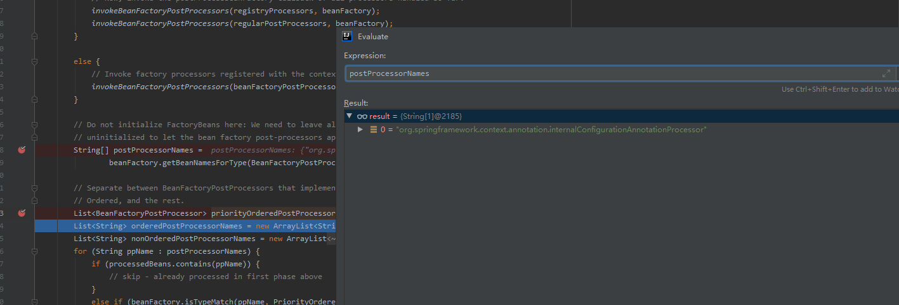
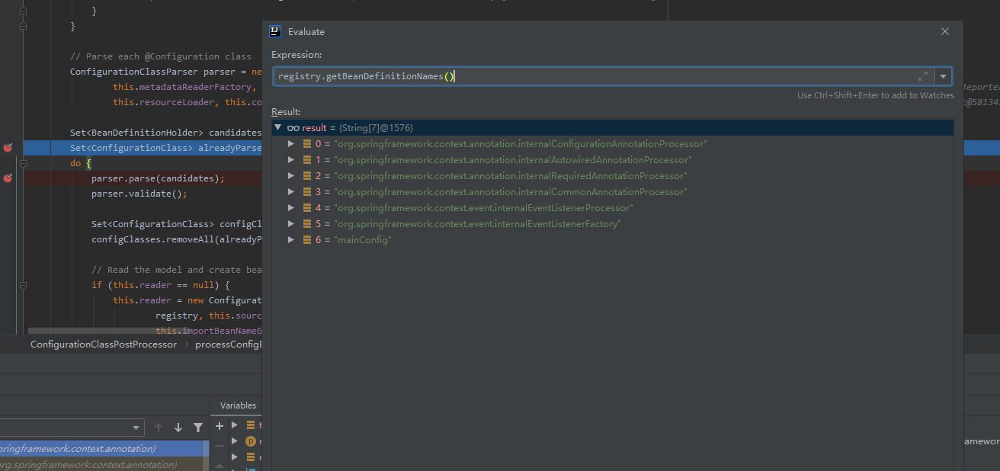

#### invokeBeanFactoryPostProcessors
```
/**
 * 在上下文中调用注册为bean的工厂处理器
 */
invokeBeanFactoryPostProcessors(beanFactory);
```

```
protected void invokeBeanFactoryPostProcessors(ConfigurableListableBeanFactory beanFactory) {

		/**
		 * getBeanFactoryPostProcessors 获取的是 this.beanFactoryPostProcessors;
		 * 何为自定义？
		 * 不通过注解形式扫描获取
		 * 而是通过手动context.addBeanFactoryPostProcessor(beanFactoryPostProcessor)完成自定义
		 *
		 * getBeanFactoryPostProcessors默认是个空的List
		 */
		PostProcessorRegistrationDelegate.invokeBeanFactoryPostProcessors(beanFactory, getBeanFactoryPostProcessors());

		// Detect a LoadTimeWeaver and prepare for weaving, if found in the meantime
		// (e.g. through an @Bean method registered by ConfigurationClassPostProcessor)
		/**
		 * 如果发现loadTimeWeaver的Bean
		 * 添加BeanPostProcessor->LoadTimeWeaverAwareProcessor
		 */
		if (beanFactory.getTempClassLoader() == null && beanFactory.containsBean(LOAD_TIME_WEAVER_BEAN_NAME)) {
			beanFactory.addBeanPostProcessor(new LoadTimeWeaverAwareProcessor(beanFactory));
			beanFactory.setTempClassLoader(new ContextTypeMatchClassLoader(beanFactory.getBeanClassLoader()));
		}
	}
```

#### getBeanFactoryPostProcessors()
getBeanFactoryPostProcessors()方法获取的是AbstractApplicationContext#beanFactoryPostProcessors这个成员变量。
这个成员变量只能通过代码中手动编码调用AbstractApplicationContext#addBeanFactoryPostProcessor方法来添加新的元素。

打个断点演示一下

空的，因为没有通过addBeanFactoryPostProcessor方法添加BFPP，需要的话可以在main函数中执行这个方法

#### PostProcessorRegistrationDelegate类
invokeBeanFactoryPostProcessors(beanFactory)方法的主要的逻辑在
PostProcessorRegistrationDelegate.invokeBeanFactoryPostProcessors方法中：


```
   	public static void invokeBeanFactoryPostProcessors(
   			ConfigurableListableBeanFactory beanFactory, List<BeanFactoryPostProcessor> beanFactoryPostProcessors) {
   
   		// Invoke BeanDefinitionRegistryPostProcessors first, if any.
   		Set<String> processedBeans = new HashSet<String>();

        if (beanFactory instanceof BeanDefinitionRegistry) {
			BeanDefinitionRegistry registry = (BeanDefinitionRegistry) beanFactory;

			/**
			 * 常规的BeanFactoryPostProcessor
			 */
			List<BeanFactoryPostProcessor> regularPostProcessors = new ArrayList<>();

			/**
			 * 实现自定义注册bean定义逻辑的BeanFactoryPostProcessor
			 */
			List<BeanDefinitionRegistryPostProcessor> registryProcessors = new ArrayList<>();

			/**
			 * beanFactoryPostProcessors默认为空
			 * 除非通过context.addBeanFactoryPostProcessor(beanFactoryPostProcessor)添加
			 */
			for (BeanFactoryPostProcessor postProcessor : beanFactoryPostProcessors) {
				if (postProcessor instanceof BeanDefinitionRegistryPostProcessor) {
					BeanDefinitionRegistryPostProcessor registryProcessor =
							(BeanDefinitionRegistryPostProcessor) postProcessor;
					registryProcessor.postProcessBeanDefinitionRegistry(registry);
					registryProcessors.add(registryProcessor);
				}
				else {
					regularPostProcessors.add(postProcessor);
				}
			}

			// Do not initialize FactoryBeans here: We need to leave all regular beans
			// uninitialized to let the bean factory post-processors apply to them!
			// Separate between BeanDefinitionRegistryPostProcessors that implement
			// PriorityOrdered, Ordered, and the rest.

			/**
			 * spring自己内部的BeanFactoryPostProcessor
			 * 不是通过context.addBeanFactoryPostProcessor(beanFactoryPostProcessor)添加的
			 */
			List<BeanDefinitionRegistryPostProcessor> currentRegistryProcessors = new ArrayList<>();

			// First, invoke the BeanDefinitionRegistryPostProcessors that implement PriorityOrdered.
			String[] postProcessorNames =
					beanFactory.getBeanNamesForType(BeanDefinitionRegistryPostProcessor.class, true, false);
			/**
			 * 这个地方得到一个BeanFactoryPostProcessor,因为是spring默认在最开始自己注册的
			 * 为什么要在最开始注册这个bean？
			 * 因为spring工厂需要去解析、扫描等功能
			 * 而这些功能都是需要在spring工厂初始化完成之前去执行
			 * 要么在工厂最开始的时候、要么在工程初始化之中，反正不能在之后
			 *
			 * 所以这里spring在一开始的时候就注册了一个BeanFactoryPostProcessor,用来插手springFactory的实例化过程
			 * 此处断点可知这个类叫做：ConfigurationAnnotationProcessor
			 */
			for (String ppName : postProcessorNames) {
				if (beanFactory.isTypeMatch(ppName, PriorityOrdered.class)) {
					currentRegistryProcessors.add(beanFactory.getBean(ppName, BeanDefinitionRegistryPostProcessor.class));
					processedBeans.add(ppName);
				}
			}
			// 排序不重要，况且这里currentRegistryProcessors只有一条数据
			sortPostProcessors(currentRegistryProcessors, beanFactory);
			// 合并List
			registryProcessors.addAll(currentRegistryProcessors);
			/**
			 * 这个方法最重要
			 * 开始循环调用BeanDefinitionRegistryPostProcessor
			 *
			 * 其中有一个spring内部的BeanDefinitionRegistryPostProcessors——>ConfigurationClassPostProcessor
			 * 处理@Configuration/@Component等注解，扫描、注册包下的类
			 * 处理@Import/@ImportResource/@Bean等...
			 */
			invokeBeanDefinitionRegistryPostProcessors(currentRegistryProcessors, registry);
			/**
			 * 清除临时变量，后面还要用这个变量
			 */
			currentRegistryProcessors.clear();

			// Next, invoke the BeanDefinitionRegistryPostProcessors that implement Ordered.
			postProcessorNames = beanFactory.getBeanNamesForType(BeanDefinitionRegistryPostProcessor.class, true, false);
			for (String ppName : postProcessorNames) {
				if (!processedBeans.contains(ppName) && beanFactory.isTypeMatch(ppName, Ordered.class)) {
					currentRegistryProcessors.add(beanFactory.getBean(ppName, BeanDefinitionRegistryPostProcessor.class));
					processedBeans.add(ppName);
				}
			}
			sortPostProcessors(currentRegistryProcessors, beanFactory);
			registryProcessors.addAll(currentRegistryProcessors);
			invokeBeanDefinitionRegistryPostProcessors(currentRegistryProcessors, registry);
			currentRegistryProcessors.clear();

			// Finally, invoke all other BeanDefinitionRegistryPostProcessors until no further ones appear.
			boolean reiterate = true;
			while (reiterate) {
				reiterate = false;
				postProcessorNames = beanFactory.getBeanNamesForType(BeanDefinitionRegistryPostProcessor.class, true, false);
				for (String ppName : postProcessorNames) {
					if (!processedBeans.contains(ppName)) {
						currentRegistryProcessors.add(beanFactory.getBean(ppName, BeanDefinitionRegistryPostProcessor.class));
						processedBeans.add(ppName);
						reiterate = true;
					}
				}
				sortPostProcessors(currentRegistryProcessors, beanFactory);
				registryProcessors.addAll(currentRegistryProcessors);
				invokeBeanDefinitionRegistryPostProcessors(currentRegistryProcessors, registry);
				currentRegistryProcessors.clear();
			}

			// Now, invoke the postProcessBeanFactory callback of all processors handled so far.
			/**
			 * 前面执行的是BeanFactoryPostProcessor的子类BeanDefinitionRegistryPostProcessor的回调
			 * 现在执行BeanFactoryPostProcessor的回调
			 */
			invokeBeanFactoryPostProcessors(registryProcessors, beanFactory);
			invokeBeanFactoryPostProcessors(regularPostProcessors, beanFactory);
		}
```


1. 首先有个判断if (beanFactory instanceof BeanDefinitionRegistry)，beanFactory 就是DefaultListableBeanFactory，它实现了BeanDefinitionRegistry，if条件成立。

2. 优先处理程序传进来的beanFactoryPostProcessors，也就是我们手动调用AbstractApplicationContext#addBeanFactoryPostProcessor方法来添加的BeanFactoryPostProcessor。
3. BeanFactoryPostProcessor是一个顶级接口，他还有一个子类BeanDefinitionRegistryPostProcessor。在该方法中声明了两个List来存放BeanFactoryPostProcessor和BeanDefinitionRegistryPostProcessor，
        以便控制这两个接口方法的执行。
   
4. 遍历传入的List<BeanFactoryPostProcessor> beanFactoryPostProcessors，将其分类放到两个List中。如果传入的是BeanDefinitionRegistryPostProcessor类，
则先执行BeanDefinitionRegistryPostProcessor类中独有的方法postProcessBeanDefinitionRegistry方法。当然，我们这里传入的List<BeanFactoryPostProcessor> beanFactoryPostProcessors为空。


```
    for (BeanFactoryPostProcessor postProcessor : beanFactoryPostProcessors) {
        if (postProcessor instanceof BeanDefinitionRegistryPostProcessor) {
            BeanDefinitionRegistryPostProcessor registryProcessor =
                    (BeanDefinitionRegistryPostProcessor) postProcessor;
            registryProcessor.postProcessBeanDefinitionRegistry(registry);
            registryProcessors.add(registryProcessor);
        }
        else {
            regularPostProcessors.add(postProcessor);
        }
    }

```

5. 第一次执行`beanFactory.getBeanNamesForType(BeanDefinitionRegistryPostProcessor.class, true, false);`方法，从容器中获取BeanDefinitionRegistryPostProcessor类型的Bean的name
（这里只是获取名称，还没有实例化Bean）。注意，程序执行到这里，Spring还没有扫描包，还没有将项目中的Bean注册到容器中。默认情况下，这里返回的数据为如下图所示
。回忆一下，这个BeanDefinition是在什么时候被加入到BeanFactory的呢？是在AnnotationConfigApplicationContext的无参构造器中创建reader时注册的BeanDefinition。
其中BeanName为`org.springframework.context.annotation.internalConfigurationAnnotationProcessor`，对应的Class为`org.springframework.context.annotation.ConfigurationClassPostProcessor`。


6. 遍历这个获取的postProcessorNames，如果实现了PriorityOrdered接口，就调用beanFactory.getBean(ppName, BeanDefinitionRegistryPostProcessor.class)方法，
从容器中获取这个Bean，将其加入到临时变量List<BeanDefinitionRegistryPostProcessor> currentRegistryProcessors中。
   
7. 对currentRegistryProcessors中的元素进行排序，然后执行BeanDefinitionRegistryPostProcessor中的特有方法postProcessBeanDefinitionRegistry。注意哦，这里没有执行其父类的方法，而是又将其放到List<BeanDefinitionRegistryPostProcessor> registryProcessors中，到后面再执行其父类方法。
    ```
    invokeBeanDefinitionRegistryPostProcessors(currentRegistryProcessors, registry);                                                                 
    ```
8. 默认情况下，此时currentRegistryProcessors中只有一个Bean即：`org.springframework.context.annotation.ConfigurationClassPostProcessor`（它实现了PriorityOrdered接口）。
`ConfigurationClassPostProcessor`是一个非常重要的类。当程序执行完`ConfigurationClassPostProcessor`的`BeanDefinitionRegistryPostProcessor`方法后，
我们程序中的Bean就被注册到了Spring容器中了，需要注意的是，这里还只是注册了BeanDefinition，还没有创建Bean对象。
   


9. 当第二次执行postProcessorNames = beanFactory.getBeanNamesForType(BeanDefinitionRegistryPostProcessor.class, true, false);方法，此时因为之前已经完成了Bean的扫描，所以如果我们有自定义的BeanDefinitionRegistryPostProcessor就可以在这里被获取了。获取之前，判断其是否实现Ordered接口，并且之前没有被执行过，则调用getBean方法，从容器中获取该Bean，然后进行排序，执行postProcessBeanDefinitionRegistry方法。


10. 前面已经按顺序执行了实现PriorityOrdered 和Ordered接口的BeanDefinitionRegistryPostProcessor，最后，执行没有实现Ordered接口的BeanDefinitionRegistryPostProcessor的postProcessBeanDefinitionRegistry方法。执行完之后再BeanDefinitionRegistryPostProcessor的父类方法postProcessBeanFactory。


11. 获取容器中还没有被执行过的实现BeanFactoryPostProcessor接口的Bean，然后按顺序执行的postProcessBeanFactory。默认情况下，这里会获取到：



由于Bean org.springframework.context.annotation.internalConfigurationAnnotationProcessor（对应的Class为org.springframework.context.annotation.ConfigurationClassPostProcessor）在之前已经被执行了，这里只会执行Bean org.springframework.context.event.internalEventListenerProcessor（对应的Class为org.springframework.context.event.EventListenerMethodProcessor）的postProcessBeanFactory方法，源码如下：

```
//org.springframework.context.event.EventListenerMethodProcessor#postProcessBeanFactory 源码
@Override
public void postProcessBeanFactory(ConfigurableListableBeanFactory beanFactory) {
	this.beanFactory = beanFactory;

	Map<String, EventListenerFactory> beans = beanFactory.getBeansOfType(EventListenerFactory.class, false, false);
	List<EventListenerFactory> factories = new ArrayList<>(beans.values());
	AnnotationAwareOrderComparator.sort(factories);
	this.eventListenerFactories = factories;
}

```
---


在创建AnnotationConfigApplicationContext对象时Spring就添加了一个非常重要的BeanFactoryPostProcessor接口实现类：ConfigurationClassPostProcessor。
注意，这里说的添加只是添加到容器的beanDefinitionMap中，还没有创建真正的实例Bean。

简单回顾一下ConfigurationClassPostProcessor是在什么时候被添加到容器中的：在AnnotationConfigApplicationContext的无参构造器中创建AnnotatedBeanDefinitionReader对象时会向传入的BeanDefinitionRegistry中
注册解析注解配置类相关的processors的BeanDefinition，ConfigurationClassPostProcessor就是在此处被添加到容器中的。


```
public static Set<BeanDefinitionHolder> registerAnnotationConfigProcessors(
        BeanDefinitionRegistry registry, Object source) {
 
    ....    

    if (!registry.containsBeanDefinition(CONFIGURATION_ANNOTATION_PROCESSOR_BEAN_NAME)) {
        RootBeanDefinition def = new RootBeanDefinition(ConfigurationClassPostProcessor.class);
        def.setSource(source);
        beanDefs.add(registerPostProcessor(registry, def, CONFIGURATION_ANNOTATION_PROCESSOR_BEAN_NAME));
    }

    ...

```

#### ConfigurationClassPostProcessor

先看一些ConfigurationClassPostProcessor的继承体系：


ConfigurationClassPostProcessor实现了BeanDefinitionRegistryPostProcessor接口，也就拥有了在Spring容器启动时，往容器中注册BeanDefinition的能力。
我们知道，ConfigurationClassPostProcessor#postProcessBeanDefinitionRegistry方法是在refresh();方法中的invokeBeanFactoryPostProcessors(beanFactory);中被执行的，下面我们就一起来看一下该方法。


##### ConfigurationClassPostProcessor#postProcessBeanDefinitionRegistry

```
	/**
	 * Derive further bean definitions from the configuration classes in the registry.
	 */
	@Override
	public void postProcessBeanDefinitionRegistry(BeanDefinitionRegistry registry) {
		int registryId = System.identityHashCode(registry);
		if (this.registriesPostProcessed.contains(registryId)) {
			throw new IllegalStateException(
					"postProcessBeanDefinitionRegistry already called on this post-processor against " + registry);
		}
		if (this.factoriesPostProcessed.contains(registryId)) {
			throw new IllegalStateException(
					"postProcessBeanFactory already called on this post-processor against " + registry);
		}
		this.registriesPostProcessed.add(registryId);

		processConfigBeanDefinitions(registry);
	}
```
主要的逻辑在processConfigBeanDefinitions(registry);中，点开源码：
```
	/**
	 * Build and validate a configuration model based on the registry of
	 * {@link Configuration} classes.
	 */
	public void processConfigBeanDefinitions(BeanDefinitionRegistry registry) {
		List<BeanDefinitionHolder> configCandidates = new ArrayList<BeanDefinitionHolder>();
        
        // 获取所有的BeanDefinitionName
		String[] candidateNames = registry.getBeanDefinitionNames();

		for (String beanName : candidateNames) {
			BeanDefinition beanDef = registry.getBeanDefinition(beanName);
			if (ConfigurationClassUtils.isFullConfigurationClass(beanDef) ||
					ConfigurationClassUtils.isLiteConfigurationClass(beanDef)) {
				if (logger.isDebugEnabled()) {
					logger.debug("Bean definition has already been processed as a configuration class: " + beanDef);
				}
			}
            // 校验是否为配置类
            // 配置类分为两种 Full @Configuration vs “lite” @Bean mode
            // 校验之后在 BeanDefinition 中添加标志属性
            // 如果满足条件则加入到configCandidates
			else if (ConfigurationClassUtils.checkConfigurationClassCandidate(beanDef, this.metadataReaderFactory)) {
				configCandidates.add(new BeanDefinitionHolder(beanDef, beanName));
			}
		}

		// Return immediately if no @Configuration classes were found
		if (configCandidates.isEmpty()) {
			return;
		}

		// Sort by previously determined @Order value, if applicable
		Collections.sort(configCandidates, new Comparator<BeanDefinitionHolder>() {
			@Override
			public int compare(BeanDefinitionHolder bd1, BeanDefinitionHolder bd2) {
				int i1 = ConfigurationClassUtils.getOrder(bd1.getBeanDefinition());
				int i2 = ConfigurationClassUtils.getOrder(bd2.getBeanDefinition());
				return (i1 < i2) ? -1 : (i1 > i2) ? 1 : 0;
			}
		});

		// Detect any custom bean name generation strategy supplied through the enclosing application context
		SingletonBeanRegistry sbr = null;
        // 传入的 registry 是 DefaultListableBeanFactory
		if (registry instanceof SingletonBeanRegistry) {
			sbr = (SingletonBeanRegistry) registry;
			if (!this.localBeanNameGeneratorSet && sbr.containsSingleton(CONFIGURATION_BEAN_NAME_GENERATOR)) {
                //获取自定义BeanNameGenerator,一般情况下为空
				BeanNameGenerator generator = (BeanNameGenerator) sbr.getSingleton(CONFIGURATION_BEAN_NAME_GENERATOR);
				this.componentScanBeanNameGenerator = generator;
				this.importBeanNameGenerator = generator;
			}
		}

		// Parse each @Configuration class
        // new ConfigurationClassParser,用来解析 @Configuration 类
		ConfigurationClassParser parser = new ConfigurationClassParser(
				this.metadataReaderFactory, this.problemReporter, this.environment,
				this.resourceLoader, this.componentScanBeanNameGenerator, registry);

        // 将 configCandidates 转成 set  candidates , 去重
		Set<BeanDefinitionHolder> candidates = new LinkedHashSet<BeanDefinitionHolder>(configCandidates);
		Set<ConfigurationClass> alreadyParsed = new HashSet<ConfigurationClass>(configCandidates.size());
		do {
            // 该方法负责解析配置类、扫描包、注册BeanDefinition
			parser.parse(candidates);
			parser.validate();

			Set<ConfigurationClass> configClasses = new LinkedHashSet<ConfigurationClass>(parser.getConfigurationClasses());
			configClasses.removeAll(alreadyParsed);

			// Read the model and create bean definitions based on its content
			if (this.reader == null) {
				this.reader = new ConfigurationClassBeanDefinitionReader(
						registry, this.sourceExtractor, this.resourceLoader, this.environment,
						this.importBeanNameGenerator, parser.getImportRegistry());
			}
            // Import类,@Bean,@ImportResource 转化为 BeanDefinition
			this.reader.loadBeanDefinitions(configClasses);
			alreadyParsed.addAll(configClasses);

			candidates.clear();
            // 再获取一下容器中BeanDefinition的数据,如果发现数量增加了,说明有新的BeanDefinition被注册了
			if (registry.getBeanDefinitionCount() > candidateNames.length) {
				String[] newCandidateNames = registry.getBeanDefinitionNames();
				Set<String> oldCandidateNames = new HashSet<String>(Arrays.asList(candidateNames));
				Set<String> alreadyParsedClasses = new HashSet<String>();
				for (ConfigurationClass configurationClass : alreadyParsed) {
					alreadyParsedClasses.add(configurationClass.getMetadata().getClassName());
				}
				for (String candidateName : newCandidateNames) {
					if (!oldCandidateNames.contains(candidateName)) {
						BeanDefinition bd = registry.getBeanDefinition(candidateName);
						if (ConfigurationClassUtils.checkConfigurationClassCandidate(bd, this.metadataReaderFactory) &&
								!alreadyParsedClasses.contains(bd.getBeanClassName())) {
							candidates.add(new BeanDefinitionHolder(bd, candidateName));
						}
					}
				}
				candidateNames = newCandidateNames;
			}
		}
		while (!candidates.isEmpty());

		// Register the ImportRegistry as a bean in order to support ImportAware @Configuration classes
		if (sbr != null) {
			if (!sbr.containsSingleton(IMPORT_REGISTRY_BEAN_NAME)) {
				sbr.registerSingleton(IMPORT_REGISTRY_BEAN_NAME, parser.getImportRegistry());
			}
		}

		if (this.metadataReaderFactory instanceof CachingMetadataReaderFactory) {
			((CachingMetadataReaderFactory) this.metadataReaderFactory).clearCache();
		}
	}
```

获取所有的BeanDefinitionNames，然后循环这个数组，判断其是否为配置类。


前5个是Spring注册的内置processor，最后一个是传入给AnnotationConfigApplicationContext的配置类mainConfig.class。

在Spring中存在两种ConfigurationClass，一种是FullConfigurationClass另一种是LiteConfigurationClass。

ConfigurationClassUtils#checkConfigurationClassCandidate方法内部就是在判断属于哪种配置类，并在BeanDefinition中标记判断结果。其具体的判断逻辑如下：

```
abstract class ConfigurationClassUtils {

	private static final String CONFIGURATION_CLASS_FULL = "full";

	private static final String CONFIGURATION_CLASS_LITE = "lite";

	private static final String CONFIGURATION_CLASS_ATTRIBUTE =
			Conventions.getQualifiedAttributeName(ConfigurationClassPostProcessor.class, "configurationClass");

	private static final String ORDER_ATTRIBUTE =
			Conventions.getQualifiedAttributeName(ConfigurationClassPostProcessor.class, "order");


	private static final Log logger = LogFactory.getLog(ConfigurationClassUtils.class);

	private static final Set<String> candidateIndicators = new HashSet<String>(4);

	static {
		candidateIndicators.add(Component.class.getName());
		candidateIndicators.add(ComponentScan.class.getName());
		candidateIndicators.add(Import.class.getName());
		candidateIndicators.add(ImportResource.class.getName());
	}

	/**
	 * Determine whether the given bean definition indicates a full {@code @Configuration}
	 * class, through checking {@link #checkConfigurationClassCandidate}'s metadata marker.
	 */
	public static boolean isFullConfigurationClass(BeanDefinition beanDef) {
		return CONFIGURATION_CLASS_FULL.equals(beanDef.getAttribute(CONFIGURATION_CLASS_ATTRIBUTE));
	}

	/**
	 * Determine whether the given bean definition indicates a lite {@code @Configuration}
	 * class, through checking {@link #checkConfigurationClassCandidate}'s metadata marker.
	 */
	public static boolean isLiteConfigurationClass(BeanDefinition beanDef) {
		return CONFIGURATION_CLASS_LITE.equals(beanDef.getAttribute(CONFIGURATION_CLASS_ATTRIBUTE));
	}

```

判断configCandidates变量中存放的

配置类是否为空，如果不为空，则对其进行排序。


创建ConfigurationClassParser对象，用于解析@Configuration类，完成包的扫描、BeanDefinition的注册。主要通过执行parser.parse(candidates);方法来完成。

执行parser.parse(candidates)方法前 ：



执行parser.parse(candidates)方法后 ：

解析完配置类之后，紧接着又执行了this.reader.loadBeanDefinitions(configClasses);方法。这个方法主要是用来处理Import类、@Bean和@ImportResource注解。

最后又加了入了对ImportAware接口支持所需要的Bean。
```
// Register the ImportRegistry as a bean in order to support ImportAware @Configuration classes
if (sbr != null && !sbr.containsSingleton(IMPORT_REGISTRY_BEAN_NAME)) {
	sbr.registerSingleton(IMPORT_REGISTRY_BEAN_NAME, parser.getImportRegistry());
}
```

---
#### ConfigurationClassParser 解析配置类