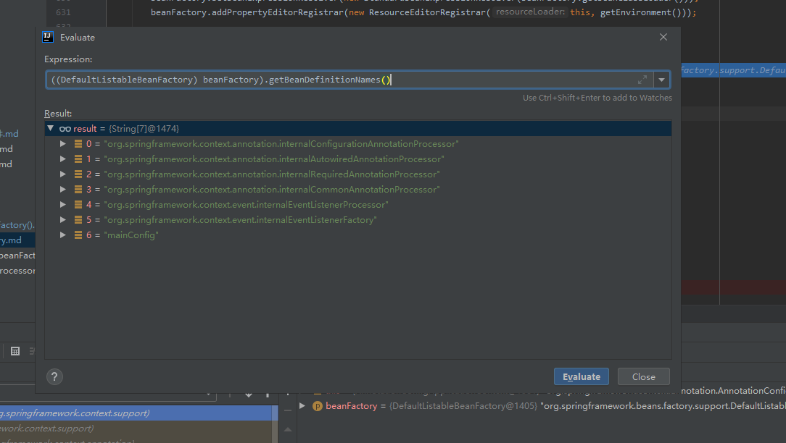
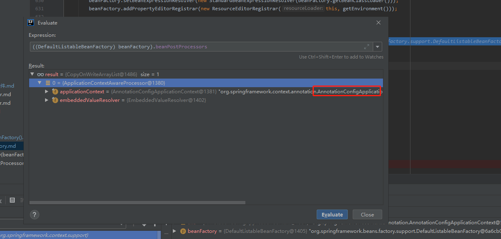

```
/**
* 准备bean工厂
**/
prepareBeanFactory(beanFactory);
```
#### prepareBeanFactory

以下就是整个prepareBeanFactory方法的内容
```
// org.springframework.context.support.AbstractApplicationContext.prepareBeanFactory

protected void prepareBeanFactory(ConfigurableListableBeanFactory beanFactory) {
		// Tell the internal bean factory to use the context's class loader etc.
		/**
		 * 设置 beanFactory 的 classLoader 为当前 context 的 classLoader
		 */
		beanFactory.setBeanClassLoader(getClassLoader());

		/**
		 * 设置 beanFactory 的表达式语言处理器，Spring3 增加了表达式语言的支持
		 * 模板默认以前缀“#{”开头，以后缀“}”结尾
		 * 可以修改默认额前缀后缀
		 * 通过beanFactory.getBeanExpressionResolver()获得BeanExpressionResolver
		 * 然后resolver.setExpressionPrefix("%{");resolver.setExpressionSuffix("}");
		 *
		 * 那么什么时候用到这个解析器？
		 * 就是在Bean进行初始化后会有属性填充的一步,方法如下:
		 * protected void populateBean(String beanName, RootBeanDefinition mbd, BeanWrapper bw) {
		 * 	//属性填充
		 * 	applyPropertyValues(beanName, mbd, bw, pvs);
		 * }
		 * 最终会通过AbstractBeanFactory中的evaluateBeanDefinitionString方法进行解析
		 * 然后这时候就进到StandardBeanExpressionResolver中的evaluate方法中进行解析了
		 */
		beanFactory.setBeanExpressionResolver(new StandardBeanExpressionResolver(beanFactory.getBeanClassLoader()));

		/**
         * 设置 beanFactory 的表达式语言处理器，Spring3 增加了表达式语言的支持
         *
		 * spring内部的属性编辑器
		 * 添加PropertyEditor属性编辑器（可以将我们的property动态设置为bean里面对应的属性类型）
		 * 比如：property赋值的是路径名(classpath/spring.xml)，而对应bean属性设置的是Resource，则有spring的ResourceEditor完成转换
		 * springframework-bean下的propertyEditors包下有很多spring自带的属性编辑器
		 * 其中刚才提到的ResourceEditor在springframework-core下的io包里面
		 *
		 * 可以自定义属性编辑器，通过实现PropertyEditorSupport接口，spring中自带的属性编辑器也是这么做的
		 * 使用ApplicationContext,只需要在配置文件中通过CustomEditorConfigurer注册即可。
		 * CustomEditorConfigurer实现了BeanFactoryPostProcessor接口，因而是一个Bean工厂后置处理器
		 * 在Spring容器中加载配置文件并生成BeanDefinition后会被执行。CustomEditorConfigurer在容器启动时有机会注册自定义的属性编辑器
		 */
		beanFactory.addPropertyEditorRegistrar(new ResourceEditorRegistrar(this, getEnvironment()));

		// Configure the bean factory with context callbacks.
		/**
		 * 添加一个BPP
         * 增加 BeanPostProcessor 实例 ApplicationContextAwareProcessor
         * ApplicationContextAwareProcessor 主要作用是对  Aware接口的支持,如果实现了相应的 Aware接口，则注入对应的资源
		 */
		beanFactory.addBeanPostProcessor(new ApplicationContextAwareProcessor(this));
		/**
		 * 跳过以下6个属性的自动注入
		 * 因为在ApplicationContextAwareProcessor中已经完成了手动注入
		 */
		beanFactory.ignoreDependencyInterface(EnvironmentAware.class);
		beanFactory.ignoreDependencyInterface(EmbeddedValueResolverAware.class);
		beanFactory.ignoreDependencyInterface(ResourceLoaderAware.class);
		beanFactory.ignoreDependencyInterface(ApplicationEventPublisherAware.class);
		beanFactory.ignoreDependencyInterface(MessageSourceAware.class);
		beanFactory.ignoreDependencyInterface(ApplicationContextAware.class);

		// BeanFactory interface not registered as resolvable type in a plain factory.
		// MessageSource registered (and found for autowiring) as a bean.
		/**
		 * 注册几个自动装配相关的类和实例
		 * 在应用代码就可以通过类型自动装配把工厂实例和ApplicationContext实例设置到自定义bean的属性中
		 *
		 * 例如：这几个属性都会被自动设置，虽然没有在显示的在bean定义xml中注入它们
		 * private BeanFactory beanFactory;
		 * private ResourceLoader resourceLoader;
		 * private ApplicationEventPublisher appEventPublisher;
		 * private ApplicationContext appContext;
		 */
		beanFactory.registerResolvableDependency(BeanFactory.class, beanFactory);
		beanFactory.registerResolvableDependency(ResourceLoader.class, this);
		beanFactory.registerResolvableDependency(ApplicationEventPublisher.class, this);
		beanFactory.registerResolvableDependency(ApplicationContext.class, this);

		// Register early post-processor for detecting inner beans as ApplicationListeners.
		/**
		 * 添加一个BPP，处理时间监听器
		 */
		beanFactory.addBeanPostProcessor(new ApplicationListenerDetector(this));

		// Detect a LoadTimeWeaver and prepare for weaving, if found.
		/**
		 * 当容器检查到定义了名称为loadTimeWeaver的bean时
		 * 会注册一个LoadTimeWeaverAwareProcessor到容器中
		 *
		 * 这个BPP用来处理LoadTimeWeaverAware接口的
		 * 把LTW实例设置到实现了LoadTimeWeaverAware接口的bean中
		 */
		if (beanFactory.containsBean(LOAD_TIME_WEAVER_BEAN_NAME)) {
			beanFactory.addBeanPostProcessor(new LoadTimeWeaverAwareProcessor(beanFactory));
			// Set a temporary ClassLoader for type matching.
			beanFactory.setTempClassLoader(new ContextTypeMatchClassLoader(beanFactory.getBeanClassLoader()));
		}

		// Register default environment beans.
		/**
		 * 就是一些系统配置和系统环境信息
		 * 如果发现没有这些bean则spring自己注册
		 */
		if (!beanFactory.containsLocalBean(ENVIRONMENT_BEAN_NAME)) {
            // Environment
			beanFactory.registerSingleton(ENVIRONMENT_BEAN_NAME, getEnvironment());
		}
		if (!beanFactory.containsLocalBean(SYSTEM_PROPERTIES_BEAN_NAME)) {
            // System Properties
			beanFactory.registerSingleton(SYSTEM_PROPERTIES_BEAN_NAME, getEnvironment().getSystemProperties());
		}
		if (!beanFactory.containsLocalBean(SYSTEM_ENVIRONMENT_BEAN_NAME)) {
            // System Environment   
			beanFactory.registerSingleton(SYSTEM_ENVIRONMENT_BEAN_NAME, getEnvironment().getSystemEnvironment());
		}
	}
```

#### 设置beanFactory类加载器
这里的类加载器就是上下文默认的类加载器
```
/**
* 设置 beanFactory 的 classLoader 为当前 context 的 classLoader
 */
beanFactory.setBeanClassLoader(getClassLoader());
```
进入到父类DefaultResourceLoader类中
```
public ClassLoader getClassLoader() {
		return (this.classLoader != null ? this.classLoader : ClassUtils.getDefaultClassLoader());
	}
```
其实在执行上下文默认构造函数时就初始化了classLoader
```
public DefaultResourceLoader() {
		this.classLoader = ClassUtils.getDefaultClassLoader();
	}
```

#### 设置bean表达式解释器
设置 beanFactory 的表达式语言处理器，Spring3 增加了表达式语言的支持
```
 /**
 * 设置 beanFactory 的表达式语言处理器，Spring3 增加了表达式语言的支持
 * 模板默认以前缀“#{”开头，以后缀“}”结尾
 * 可以修改默认额前缀后缀
 * 通过beanFactory.getBeanExpressionResolver()获得BeanExpressionResolver
 * 然后resolver.setExpressionPrefix("%{");resolver.setExpressionSuffix("}");
 *
 * 那么什么时候用到这个解析器？
 * 就是在Bean进行初始化后会有属性填充的一步,方法如下:
 * protected void populateBean(String beanName, RootBeanDefinition mbd, BeanWrapper bw) {
 * 	// 属性填充
 * 	applyPropertyValues(beanName, mbd, bw, pvs);
 * }
 * 最终会通过AbstractBeanFactory中的evaluateBeanDefinitionString方法进行解析
 * 然后这时候就进到StandardBeanExpressionResolver中的evaluate方法中进行解析了
 */
beanFactory.setBeanExpressionResolver(new StandardBeanExpressionResolver(beanFactory.getBeanClassLoader()));
```
 - 增加对 SPEL 语言的支持

#### 设置PropertyEditor属性编辑器

为 beanFactory 增加一个默认的 propertyEditor，这个主要是对 bean 的属性等设置管理的一个工具
```
/**
 * 添加PropertyEditor属性编辑器（可以将我们的property动态设置为bean里面对应的属性类型）
 * 比如：property赋值的是路径名(classpath/spring.xml)，而对应bean属性设置的是Resource，则有spring的ResourceEditor完成转换
 * springframework-bean下的propertyEditors包下有很多spring自带的属性编辑器
 * 其中刚才提到的ResourceEditor在springframework-core下的io包里面
 *
 * 可以自定义属性编辑器，通过实现PropertyEditorSupport接口，spring中自带的属性编辑器也是这么做的
 * 使用ApplicationContext,只需要在配置文件中通过CustomEditorConfigurer注册即可。
 * CustomEditorConfigurer实现了BeanFactoryPostProcessor接口，因而是一个Bean工厂后置处理器
 * 在Spring容器中加载配置文件并生成BeanDefinition后会被执行。CustomEditorConfigurer在容器启动时有机会注册自定义的属性编辑器
 */
beanFactory.addPropertyEditorRegistrar(new ResourceEditorRegistrar(this, getEnvironment()));
```
属性编辑器在spring源码层面也有体现，spring自带了很多属性编辑器。在mybatis与spring结合使用时也有用到，可以将属性classpath/spring.xml文件路径名转换为属性Resource，可以理解为格式转换。

#### Resource属性编辑器测试
例如：
BookService.java
```
package com.evan.service;

import org.springframework.beans.factory.annotation.Value;
import org.springframework.core.io.Resource;
import org.springframework.stereotype.Service;

@Service
public class BookService {

    @Value("classpath:person.properties")
    private Resource resource;

    public Resource getResource(){
        return this.resource;
    }
}
```
###### person.properties
```
person.nickName=\u5C0F\u674E\u56DB
```
###### test
```
    @Test
    public void test03(){
        AnnotationConfigApplicationContext applicationContext = new AnnotationConfigApplicationContext(MainConfig.class);

        BookService bookService = applicationContext.getBean(BookService.class);
        Resource resource = bookService.getResource();
        System.out.println(resource);
        try {
            Properties properties = PropertiesLoaderUtils.loadProperties(resource);
            System.out.println(properties.getProperty("person.nickName"));
        } catch (IOException e) {
            e.printStackTrace();
        }

    }
}
```
控台打印
```
class path resource [person.properties]
小李四
```
这就是spring内置了Resource的属性编辑器。顺带还测试了下直接转换为Properties

##### Properties属性编辑器测试
```
@Value("classpath:test.properties")
    private Properties properties;

    public Properties getProperties(){
        return this.properties;
    }

```
```
Properties properties = bookService.getProperties();
System.out.println(properties);
```
```
{classpath=person.properties}
```
发现它是直接将"classpath:test.properties"字符串解析为Properties，并没有解析里面的配置信息。可以看出spring没有内置的Properties属性编辑器，或者说内置的Properties属性编辑器并不会去解析配置文件，单单把字符串解析为了Properties

#### 添加后置处理器ApplicationContextAwareProcessor
该处理器是一个BPP(BeanPostProcessor)，bean的后置处理器，在实例化bean的时候会调用
```
/**
* 添加一个BPP
 * ApplicationContextAwareProcessor：能够在bean中获得各种*Aware
 */
beanFactory.addBeanPostProcessor(new ApplicationContextAwareProcessor(this));
```


ApplicationContextAwareProcessor类实现了BeanPostProcessor接口，其中主要是 Override 了postProcessBeforeInitialization方法，其作用主要是用来对 Aware系列接口的支持，
发现Bean实现了Aware系列接口，就调用其相应的方法，具体为哪些Aware接口，请查看源码：

```

class ApplicationContextAwareProcessor implements BeanPostProcessor {

	private final ConfigurableApplicationContext applicationContext;

	private final StringValueResolver embeddedValueResolver;


	/**
	 * Create a new ApplicationContextAwareProcessor for the given context.
	 */
	public ApplicationContextAwareProcessor(ConfigurableApplicationContext applicationContext) {
		this.applicationContext = applicationContext;
		this.embeddedValueResolver = new EmbeddedValueResolver(applicationContext.getBeanFactory());
	}


	@Override
	public Object postProcessBeforeInitialization(final Object bean, String beanName) throws BeansException {
		AccessControlContext acc = null;

		if (System.getSecurityManager() != null &&
				(bean instanceof EnvironmentAware || bean instanceof EmbeddedValueResolverAware ||
						bean instanceof ResourceLoaderAware || bean instanceof ApplicationEventPublisherAware ||
						bean instanceof MessageSourceAware || bean instanceof ApplicationContextAware)) {
			acc = this.applicationContext.getBeanFactory().getAccessControlContext();
		}

		if (acc != null) {
			AccessController.doPrivileged(new PrivilegedAction<Object>() {
				@Override
				public Object run() {
					invokeAwareInterfaces(bean);
					return null;
				}
			}, acc);
		}
		else {
			invokeAwareInterfaces(bean);
		}

		return bean;
	}

	private void invokeAwareInterfaces(Object bean) {
		if (bean instanceof Aware) {
			if (bean instanceof EnvironmentAware) {
				((EnvironmentAware) bean).setEnvironment(this.applicationContext.getEnvironment());
			}
			if (bean instanceof EmbeddedValueResolverAware) {
				((EmbeddedValueResolverAware) bean).setEmbeddedValueResolver(this.embeddedValueResolver);
			}
			if (bean instanceof ResourceLoaderAware) {
				((ResourceLoaderAware) bean).setResourceLoader(this.applicationContext);
			}
			if (bean instanceof ApplicationEventPublisherAware) {
				((ApplicationEventPublisherAware) bean).setApplicationEventPublisher(this.applicationContext);
			}
			if (bean instanceof MessageSourceAware) {
				((MessageSourceAware) bean).setMessageSource(this.applicationContext);
			}
			/**
			 * 自定义的bean实现了ApplicationContextAware接口并提供setter方法，就能得到applicationContext
			 */
			if (bean instanceof ApplicationContextAware) {
				((ApplicationContextAware) bean).setApplicationContext(this.applicationContext);
			}
		}
	}

	@Override
	public Object postProcessAfterInitialization(Object bean, String beanName) {
		return bean;
	}

}

```
程序运行到这里，再看看一下Spring容器中有哪些数据：

-  BeanDefinition对象



- 3 个单例Bean




---

##### BeanPostProcessor接口有两个方法：
1. postProcessBeforeInitialization：初始化前执行
2. postProcessAfterInitialization：初始化后执行


例如：

bean实现了ApplicationContextAware就可以拿到当前上下文对象

```
@Repository
public class DemoDao implements ApplicationContextAware {

	private ApplicationContext applicationContext;

	@Override
	public void setApplicationContext(ApplicationContext applicationContext) throws BeansException {
		applicationContext = this.applicationContext;
	}

}
```

---

#### 跳过特定属性的自动注入

```
/**
 * 跳过以下6个属性的自动注入
 * 因为在ApplicationContextAwareProcessor后置处理器中通过setter注入
 */
beanFactory.ignoreDependencyInterface(EnvironmentAware.class);
beanFactory.ignoreDependencyInterface(EmbeddedValueResolverAware.class);
beanFactory.ignoreDependencyInterface(ResourceLoaderAware.class);
beanFactory.ignoreDependencyInterface(ApplicationEventPublisherAware.class);
beanFactory.ignoreDependencyInterface(MessageSourceAware.class);
beanFactory.ignoreDependencyInterface(ApplicationContextAware.class);
```
#### 注册几个自动装配规则
```
/**
 * 注册几个自动装配相关的类和实例
 * 在应用代码就可以通过类型自动装配把工厂实例和ApplicationContext实例设置到自定义bean的属性中
 *
 * 例如：这几个属性都会被自动设置，虽然没有在显示的在bean定义xml中注入它们
 * private BeanFactory beanFactory;
 * private ResourceLoader resourceLoader;
 * private ApplicationEventPublisher appEventPublisher;
 * private ApplicationContext appContext;
 */
beanFactory.registerResolvableDependency(BeanFactory.class, beanFactory);
beanFactory.registerResolvableDependency(ResourceLoader.class, this);
beanFactory.registerResolvableDependency(ApplicationEventPublisher.class, this);
beanFactory.registerResolvableDependency(ApplicationContext.class, this);
```
例如：

这样也可以拿到当前上下文对象ApplicationContextAware
```
@Repository
public class DemoDao1 {

	@Autowired
	private ApplicationContext appContext;
}
```
#### 添加后置处理器ApplicationListenerDetector
这是一个BBP，在bean初始化完成后判断是不是监听器，是的话将它注册到应用的事件多播器上。
事件监听到后面会专门写一篇介绍。
```
public Object postProcessAfterInitialization(Object bean, String beanName) {
		/**
		 * 检测到bean是一个 ApplicationListener 应用事件监听器
		 */
		if (bean instanceof ApplicationListener) {
			// potentially not detected as a listener by getBeanNamesForType retrieval
			Boolean flag = this.singletonNames.get(beanName);
			if (Boolean.TRUE.equals(flag)) {
				// singleton bean (top-level or inner): register on the fly
				/**
				 * 如果当前 ApplicationListener bean scope 是 singleton 单例模式
				 * 则将它注册到应用的事件多播器上
				 */
				this.applicationContext.addApplicationListener((ApplicationListener<?>) bean);
			}
			else if (Boolean.FALSE.equals(flag)) {
				/**
				 * 如果当前 ApplicationListener bean scope 不是 singleton 单例模式，
				 * 则尝试输出警告日志，说明情况
				 */
				if (logger.isWarnEnabled() && !this.applicationContext.containsBean(beanName)) {
					// inner bean with other scope - can't reliably process events
					logger.warn("Inner bean '" + beanName + "' implements ApplicationListener interface " +
							"but is not reachable for event multicasting by its containing ApplicationContext " +
							"because it does not have singleton scope. Only top-level listener beans are allowed " +
							"to be of non-singleton scope.");
				}
				this.singletonNames.remove(beanName);
			}
		}
		return bean;
	}
```
#### 添加后置处理器LoadTimeWeaverAwareProcessor
```
String LOAD_TIME_WEAVER_BEAN_NAME = "loadTimeWeaver";

/**
* 当容器检查到定义了名称为loadTimeWeaver的bean时
 * 会注册一个LoadTimeWeaverAwareProcessor到容器中
 *
 * 这个BPP用来处理LoadTimeWeaverAware接口的
 * 把LTW实例设置到实现了LoadTimeWeaverAware接口的bean中
 */
if (beanFactory.containsBean(LOAD_TIME_WEAVER_BEAN_NAME)) {
	beanFactory.addBeanPostProcessor(new LoadTimeWeaverAwareProcessor(beanFactory));
	// Set a temporary ClassLoader for type matching.
	beanFactory.setTempClassLoader(new ContextTypeMatchClassLoader(beanFactory.getBeanClassLoader()));
}
```
