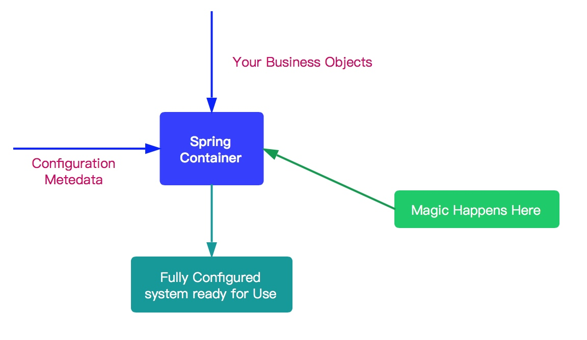

通过阅读代码你会发现很乱，如果不好好的撸一撸啥都记不住。

### IOC 容器的初始化
1. Resource 定位
2. BeanDefinition 的载入和解析
3. BeanDefinition 注册

- **Resource 定位**：我们一般用外部资源来描述 Bean 对象，所以在初始化 IOC 容器的第一步就是需要定位这个外部资源。
- **BeanDefinition 的载入和解析**：装载就是 BeanDefinition 的载入。BeanDefinitionReader 读取、解析 Resource 资源，也就是将用户定义的 Bean 表示成 IOC 容器的内部数据结构：BeanDefinition。在 IOC 容器内部维护着一个 BeanDefinition Map 的数据结构，在配置文件中每一个都对应着一个BeanDefinition对象。
- **BeanDefinition 注册**：向IOC容器注册在第二步解析好的 BeanDefinition，这个过程是通过 BeanDefinitionRegistery 接口来实现的。在 IOC 容器内部其实是将第二个过程解析得到的 BeanDefinition 注入到一个 HashMap 容器中，IOC 容器就是通过这个 HashMap 来维护这些 BeanDefinition 的。在这里需要注意的一点是这个过程并没有完成依赖注入，依赖注册是发生在应用第一次调用 getBean() 向容器索要 Bean 时。当然我们可以通过设置预处理，即对某个 Bean 设置 lazyinit 属性，那么这个 Bean 的依赖注入就会在容器初始化的时候完成。

(此图来自《Spring 揭秘》) Spring IOC 容器所起的作用如上图所示，它会以某种方式加载 Configuration Metadata，将其解析注册到容器内部，然后回根据这些信息绑定整个系统的对象，最终组装成一个可用的基于轻量级容器的应用系统。 Spring 在实现上述功能中，将整个流程分为两个阶段：容器初始化阶段和加载bean 阶段。

- 容器初始化阶段：首先通过某种方式加载 Configuration Metadata (主要是依据 Resource、ResourceLoader 两个体系)，然后容器会对加载的 Configuration MetaData 进行解析和分析，并将分析的信息组装成 BeanDefinition，并将其保存注册到相应的 BeanDefinitionRegistry 中。至此，Spring IOC 的初始化工作完成。
- 加载 bean 阶段：经过容器初始化阶段后，应用程序中定义的 bean 信息已经全部加载到系统中了，当我们显示或者隐式地调用 getBean() 时，则会触发加载 bean 阶段。在这阶段，容器会首先检查所请求的对象是否已经初始化完成了，如果没有，则会根据注册的 bean 信息实例化请求的对象，并为其注册依赖，然后将其返回给请求方。至此第二个阶段也已经完成。